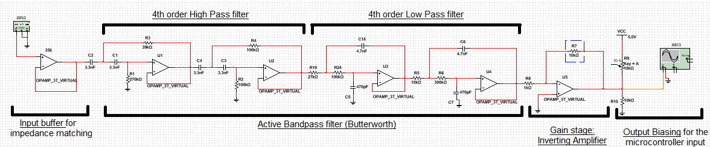

# phone-tapping-scenario
Scenario Y, 2nd Year UCL EEE, Phone Line Tapping Scenario
January 2016

## Design Brief
A small company that is using an external switchboard for its phone exchange would like to monitor their employees phone usage. For that purpose you have been hired to setup an apparatus (hardware and software) to be non destructively attached to the phone line that would be able to give as an output the phone number called. The phone used by the company gives a standard dual tone multi-frequency (DTMF) dialling system and the phone line would also carry the internet ADSL and other signals.

## Overview
The solution consists of two main stages: analogue filtering of the acquired signal and then digital processing of the filtered signal.
The signal is picked up by coiling a wire around a length of the telephone cable without cutting the line, this is fed through several stages of analogue filters to remove unwanted noise and signals such as 50Hz mains and ADSL. The filtered signal is then passed into an analog-to-digital converter (ADC) in a microcontroller before being digitally processed to find which frequencies are present. From these, the DTMF tones being dialled can be ascertained. Two versions of the digital section have been developed, one to run entirely on an MSP430 microcontroller and one where the ADC values are sent over serial to a python program, which can then automatically call the number.

## Analogue Section
The signal acquired from the phone line will have the required DTMF tones lying in the frequency range 697Hz - 1477Hz. The signal could also contain ADSL which will be >25kHz and the rudimentary antenna will likely pick up a lot of noise. Therefore the analogue section consists of several stages:

1. Simple buffer stage for impedance matching
2. 4th Order High Pass Filter - removes low frequency noise, particularly 50Hz
3. 4th Order Low Pass Filter - removes high frequencies, particularly ADSL
4. Gain Stage (Inverting Amplifier)
5. DC Biasing for input to ADC

Multisim circuits for the above can be found in the relevant directory.

## Digital Processing
Both versions of the digital section are based on the same principles. The signal is passed into an ADC and processed in real-time at a certain sample rate, using the Goertzel Algorithm configured to find the the DTMF frequencies: [697Hz, 770Hz, 852Hz, 941Hz] and [1209Hz, 1336Hz, 1477Hz]. The Goertzel algorithm allows us to detect tones more efficiently, with far less horsepower than the Fast Fourier Transform for example. The theory behind the algorithm can be easily found through a search and so it won't be repeated here, but it is essentially a series of bandpass infinite impulse response (IIR) filters at the relevant frequencies.

Once the Goertzel algorithm has returned a magnitude for each frequency after N samples, they are compared against a threshold value to determine if the frequencies are present. The most likely frequency, with the highest magnitude, for each group is taken and then the relevant digit looked up and saved:

| | 1209Hz | 1336Hz | 1477Hz |
|:---|:---:|:---:|:---:|
| **697Hz** | 1 | 2 | 3 |
| **770Hz** | 4 | 5 | 6 |
| **852Hz** | 7 | 8 | 9 |
| **941Hz** | * | 0 | # |

The C version is written to be run on an isolated MSP430 with the decoded number displayed on an LCD. A timer is configured to trigger an interrupt at a specific interval to get a certain sampling frequency, 4kHz was found to be high enough to be able to detect our highest frequencies without any issues whilst leaving enough time between samples for processing. The 10bit ADC is triggered at this sample rate and then the resolution of the result reduced to 8bit to reduce the processing time required.

The Python version has been written to be able to process pre-recorded data files or real-time data from a serial port. A crude Arduino sketch has been written to read the signal at 4kHz using it's ADC and then write the resulting value to the connected computer over a serial port. The Python script will then process the signal in real-time before displaying the decoded number. It can then also use the Twilio API to automatically call or send an SMS to the number within seconds of decoding - useful in winning competitions...

## Authors
- Daniel Saul
- Franky Saxena
- Bruno Calogero
- Theo Velon
